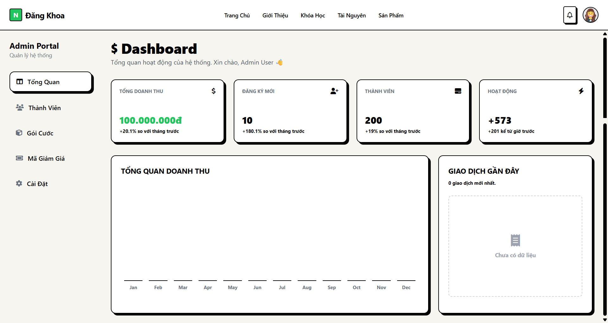

# Neo-Brutalism Admin Dashboard 🟢

Một giao diện quản trị (Admin Dashboard) hiện đại, đậm chất cá tính với phong cách thiết kế **Soft Neo-Brutalism** (Tân Thô Mộc). Dự án được xây dựng trên nền tảng **Vue 3** (Vite) và **Tailwind CSS**.



## ✨ Đặc điểm nổi bật

* **Phong cách Neo-Brutalism:** Sử dụng viền đen dày, đổ bóng cứng (hard shadow), màu sắc tương phản cao (Kem/Đen/Xanh lá) và typography đậm.
* **Công nghệ mới nhất:** Vue 3 (Composition API + `<script setup>`) và Vite cho tốc độ phát triển siêu nhanh.
* **Responsive Layout:** Bố cục Sidebar cố định, nội dung cuộn độc lập (Fixed Sidebar, Scrollable Main Content).
* **Tùy biến cao:** Hệ thống màu sắc và đổ bóng được cấu hình tập trung trong `tailwind.config.js`.
* **Component hóa:** Tái sử dụng code hiệu quả với các component `NeoCard`, `Sidebar`, `Header`.
* **Routing:** Cấu hình Vue Router chuẩn cho các trang quản trị (`/quan-tri`).
* **Custom Scrollbar:** Thanh cuộn được tùy biến riêng để đồng bộ với phong cách thiết kế.

## 🛠️ Công nghệ sử dụng

* [Vue.js 3](https://vuejs.org/) - Framework JavaScript chính.
* [Vite](https://vitejs.dev/) - Build tool & Server phát triển.
* [Tailwind CSS](https://tailwindcss.com/) - Utility-first CSS framework.
* [Vue Router 4](https://router.vuejs.org/) - Quản lý điều hướng trang.
* [FontAwesome](https://fontawesome.com/) - Bộ icon (sử dụng qua CDN).
* [Google Fonts](https://fonts.google.com/) - Font chữ "Public Sans".

## 📂 Cấu trúc dự án

```text
src/
├── assets/            # Tài nguyên tĩnh (ảnh, css global)
├── components/        # Các thành phần tái sử dụng
│   ├── NeoCard.vue    # Component khung viền đen + bóng cứng
│   ├── Header.vue     # Thanh điều hướng trên cùng
│   └── Sidebar.vue    # Thanh menu bên trái (có active state)
├── layouts/           # Bố cục trang
│   └── DefaultLayout.vue # Layout chính (Sidebar + Header + RouterView)
├── views/             # Các trang màn hình
│   ├── Dashboard.vue  # Trang tổng quan
│   ├── Members.vue    # Quản lý thành viên
│   ├── Packages.vue   # Quản lý gói cước
│   ├── Coupons.vue    # Quản lý mã giảm giá
│   └── Settings.vue   # Cài đặt hệ thống
├── router/            # Cấu hình đường dẫn (Routing)
│   └── index.js
├── App.vue            # Component gốc
├── main.js            # Entry point
└── style.css          # CSS Global & Custom Scrollbar

```

## 🚀 Cài đặt và Sử dụng

Đảm bảo máy tính của bạn đã cài đặt [Node.js](https://nodejs.org/) (phiên bản 16+).

### 1. Clone dự án

```bash
git clone [https://github.com/dangkhoa2004/neo_dashboard.git](https://github.com/dangkhoa2004/neo_dashboard.git)
cd neo-dashboard

```

### 2. Cài đặt các gói phụ thuộc

```bash
npm install

```

### 3. Chạy môi trường phát triển (Dev Server)

```bash
npm run dev

```

Truy cập vào địa chỉ: `http://localhost:5173/quan-tri`

### 4. Build để triển khai (Production)

```bash
npm run build

```

## 🎨 Hướng dẫn tùy biến (Customization)

### Thay đổi màu sắc chủ đạo

Mở file `tailwind.config.js` và chỉnh sửa phần `colors`:

```javascript
colors: {
  'neo-bg': '#F7F5F0',       // Màu nền trang (Kem)
  'neo-green': '#22c55e',    // Màu nhấn chủ đạo (Xanh lá) -> Đổi thành màu bạn thích
},

```

### Thay đổi độ đổ bóng (Shadow)

Cũng trong `tailwind.config.js`, chỉnh sửa phần `boxShadow`:

```javascript
boxShadow: {
  'neo': '5px 5px 0px 0px rgba(0,0,0,1)',      // Bóng mặc định
  'neo-hover': '7px 7px 0px 0px rgba(0,0,0,1)', // Bóng khi di chuột
}

```

## 📝 Các trang hiện có

1. **/quan-tri**: Dashboard thống kê (Biểu đồ giả lập CSS, Thẻ số liệu).
2. **/quan-tri/members**: Danh sách thành viên (Table style Neo-Brutalism).
3. **/quan-tri/packages**: Gói cước dịch vụ (Grid Layout).
4. **/quan-tri/coupons**: Mã giảm giá (Thiết kế dạng vé/ticket).
5. **/quan-tri/settings**: Form cài đặt (Inputs, Checkbox custom).

## 🤝 Đóng góp

Dự án được xây dựng bởi **NamNCN**. Mọi ý kiến đóng góp xin vui lòng tạo Issue hoặc Pull Request.

## 📄 License

MIT License.